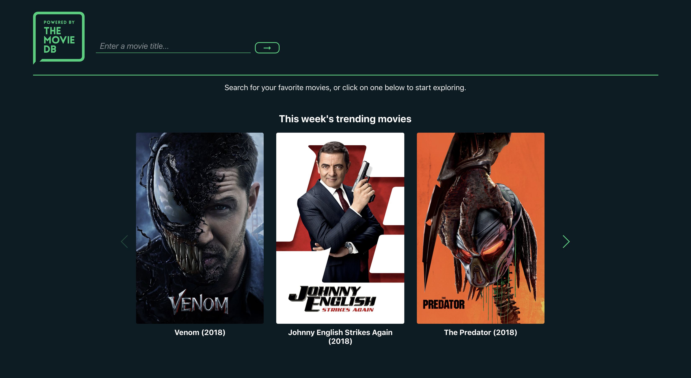

<h1>Movie Search App Vue</h1>

<h2>Summary</h2>

This movie search project was created in Vue.js, and is a refactored version of previous Movie Search projects created using jQuery and react.

<h2>Screenshots</h2>
<h3>Homepage</h3>
	
<h3>Movie Page</h3>
	
    	
<h3>Search Results</h3>
	

<h2>Technologies Used</h2>

This project was created using the following technologies:

<ul>
<li>Vue.js</li>
<li>Vue Router</li>
<li>Sass</li>
<li>Axios</li>
<li>Moment.js</li>
<li>Vue.js</li>
</ul>
<h2>Author</h2>

This project was created by Alex Manzo.

