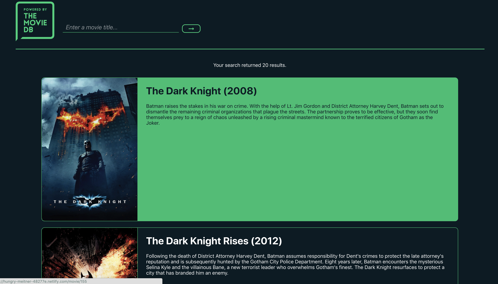

<h1>Movie Search App Vue</h1>

<h2>Summary</h2>

Refactored project to learn Vue.js. Users can search for movies, find out basic details, then disocver more movies through exploring the cast, similar movies, and more.

One significant difference from the React version is the creation of a custom slider component.

<h2>Screenshots</h2>
<h3>Homepage</h3>
	
<h3>Movie Page</h3>
	
    	
<h3>Search Results</h3>
	

<h2>Technologies Used</h2>

This project was created using the following technologies:

<ul>
<li>Vue.js</li>
<li>Vue Router</li>
<li>Sass</li>
<li>Axios</li>
<li>Moment.js</li>
<li>Vue.js</li>
</ul>
<h2>Author</h2>

This project was created by Alex Manzo.

